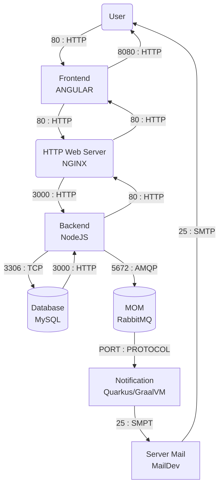

# AL : Microservices architecture

A rendre avan 18/1 23h59m59s

1 Point de penalité / jour de retard

Indiquez "Projet Fini" sur le .md

Envoyez le dépot au dépôt aux encadrants (Gitlab ISTIC) en Dev/Maintainer
- Ptemple
- wrundametkini

